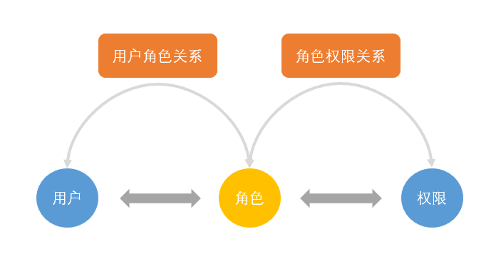
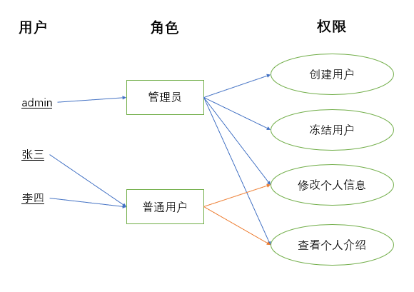
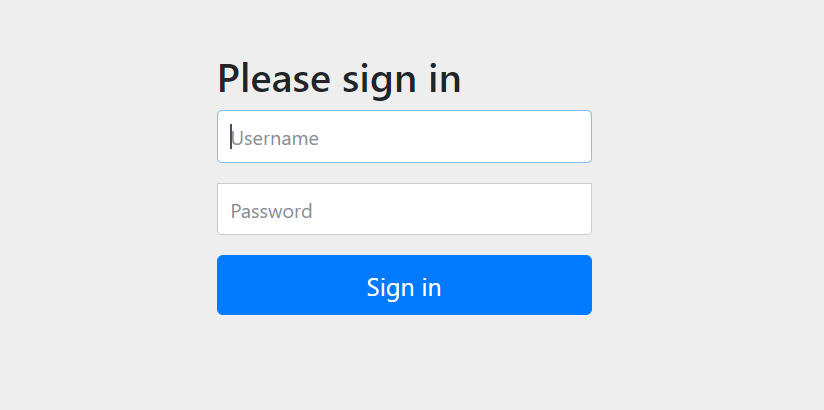

# 一.简介

本项目是一个通用的前后端分离式的权限管理系统的后端工程,通过本项目你可以了解到什么是RBAC的权限系统设计范式以及如何实现权限管理.项目用的技术比较简单:SpringBoot SpringSecurity Mybatis-Plus Jwt Redis


# 二.RBAC权限管理设计范式

## 2.1 什么是RBAC

**RBAC**是基于角色的访问控制（`Role-Based Access Control` ）在**RBAC**中，权限与角色相关联，用户通过成为适当角色的成员而得到这些角色的权限。这就极大地简化了权限的管理。这样管理都是层级相互依赖的，权限赋予给角色，而把角色又赋予用户，这样的权限设计很清楚，管理起来很方便。

**RBAC**模型（Role-Based Access Control：基于角色的访问控制）模型是20世纪90年代研究出来的一种新模型，但其实在20世纪70年代的多用户计算时期，这种思想就已经被提出来，直到20世纪90年代中后期，RBAC才在研究团体中得到一些重视，并先后提出了许多类型的RBAC模型。其中以美国George Mason大学信息安全技术实验室（LIST）提出的[RBAC96](https://www.profsandhu.com/infs767/infs767fall03/lecture01-2.pdf)模型最具有代表，并得到了普遍的公认。

**RBAC**认为权限授权的过程可以抽象地概括为：**Who是否可以对What进行How的访问操作，并对这个逻辑表达式进行判断是否为True的求解过程，也即是将权限问题转换为What、How的问题，Who、What、How构成了访问权限三元组**.

## 2.2 RBAC的组成

在RBAC模型里面，有3个基础组成部分，分别是：用户、角色和权限。

RBAC通过定义角色的权限，并对用户授予某个角色从而来控制用户的权限，实现了用户和权限的逻辑分离（区别于ACL模型），极大地方便了权限的管理

下面在讲解之前，先介绍一些名词：

- **User**（用户）：每个用户都有唯一的UID识别，并被授予不同的角色
- **Role**（角色）：不同角色具有不同的权限
- **Permission**（权限）：访问权限
- **用户-角色映射**：用户和角色之间的映射关系
- **角色-权限映射**：角色和权限之间的映射



例如下图，管理员和普通用户被授予不同的权限，普通用户只能去修改和查看个人信息，而不能创建创建用户和冻结用户，而管理员由于被授 予所有权限，所以可以做所有操作。



## 2.3 RBAC支持的安全原则

RBAC支持三个著名的安全原则：**最小权限原则**、**责任分离原则**和**数据抽象原则**

- **最小权限原则**：RBAC可以将角色配置成其完成任务所需的最小权限集合
- **责任分离原则**：可以通过调用相互独立互斥的角色来共同完成敏感的任务，例如要求一个计账员和财务管理员共同参与统一过账操作
- **数据抽象原则**：可以通过权限的抽象来体现，例如财务操作用借款、存款等抽象权限，而不是使用典型的读、写、执行权限


## 2.4 RBAC0、RBAC1、RBAC2、RBAC3简单介绍

- **RBAC0：是RBAC的核心思想。**
- **RBAC1：是把RBAC的角色分层模型。**
- **RBAC2：增加了RBAC的约束模型。**
- **RBAC3：其实是RBAC2 + RBAC1。**


# 三. RBAC实战

## 3.1 RBAC的功能模块


## 3.2 RBAC执行流程


## 3.3 数据库表的设计


总共三个表:

- 用户表: tb_user, 记录系统的用户数据
- 角色表: tb_role, 记录系统的角色数据
- 权限表: tb_right, 记录系统的权限数据
- 用户角色中间表: inner_user_role: 记录用户id和角色id之间的对应关系,降低用户表和角色表耦合度
- 角色权限中间表: inner_role_right: 记录角色id和权限id之间的对应关系,降低角色表和权限表耦合度

## 3.4 创建pojo类

本项目持久层框架使用的是Mybatis-Plus这个十分流行的ORM框架,关于Mybatis-Plus的介绍看本项目其他配套笔记.

**User(用户)类**

```java
@Data
@TableName("tb_user")
public class User {

    @TableId
    private Integer id;

    @NotBlank(message="用户名不能为空")
    private String username;

    private String password;

    @TableField(fill = FieldFill.INSERT)
    @JsonFormat(pattern = "yyyy-MM-dd HH:mm:ss", timezone = "GMT+8")
    private Date createTime; //创建时间

    @TableField(exist = false)
    private List<Role> roleList;
}
```

**Role(角色)类**

```java
@Data
@NoArgsConstructor
@TableName("tb_role")
public class Role {

    @TableId
    private Integer roleId;

    private String roleName; //角色名称

    private String roleIdentity;  //角色标识

    @TableField(exist = false)
    private List<Right> children; //权限列表
}
```

**Right(权限)类**

```java
@Data
@NoArgsConstructor
@TableName("tb_right")
public class Right {

    @TableId
    private Integer id;

    private String rightName; //权限名称

    private Integer parentId; //上一级权限父节点

    private String rootPath; //根路径

    private String icon; //图标

    private Integer level; //权限等级

    private String identity;//权限标识

    @TableField(exist = false)
    private List<Right> children = new ArrayList<>(); //子节点
}
```

## 3.5 导入依赖

```xml
<dependency>
    <!--mybatis-plus-->
    <dependency>
        <groupId>com.baomidou</groupId>
        <artifactId>mybatis-plus-boot-starter</artifactId>
        <version>3.0.5</version>
    </dependency>
    <!--SpringSecurity-->
    <dependency>
        <groupId>org.springframework.boot</groupId>
        <artifactId>spring-boot-starter-security</artifactId>
    </dependency>
    <!-- HuTool工具类-->
    <dependency>
        <groupId>cn.hutool</groupId>
        <artifactId>hutool-all</artifactId>
        <version>5.3.3</version>
    </dependency>
</dependency>
```

## 3.6 自定义IUser

自定义**IUser**继承**SpringSecurity**提供的User类,重写构造器.或者你直接使用**SpringSecurity**的**User**类,我这里只不过是为了扩充自定义的**User**的功能.

```java
public class IUser extends User {

    private Integer userId;

    public IUser(Integer userId, String username, String password, Collection<? extends GrantedAuthority> authorities) {
        super(username, password, authorities);
        this.userId = userId;
    }

    public Integer getUserId() {
        return userId;
    }

    public void setUserId(Integer userId) {
        this.userId = userId;
    }
}
```

## 3.7 自定义IUserDetailsService

自定义**IUserDetailsService**实现**SpringSecuirty**提供的**UserDetailsService**,

重写loadUserByUsername(String  username)方法,在这个方法中定义查询用户以及用户的角色,角色对应的权限逻7辑.

```java
@Service
public class IUserDetailsService implements UserDetailsService {

    @Autowired
    private UserMapper userMapper;

    @Autowired
    private RoleMapper roleMapper;

    @Autowired
    private RightMapper rightMapper;

    @Override
    public UserDetails loadUserByUsername(String username) throws UsernameNotFoundException {
        // 查询用户
        QueryWrapper<User> wrapper = new QueryWrapper<>();
        wrapper.eq("username", username)
               .eq("status", User.USER_STATUS_ON);

        User user = userMapper.selectOne(wrapper);

        if (user != null) {
            // 声明一个权限集合
            List<GrantedAuthority> authorityList = new ArrayList<>();

            // 查询用户的角色
            List<Role> roleList = roleMapper.selectRoleListByUID(user.getId());

            if (!CollectionUtils.isEmpty(roleList)) {
                for (Role role : roleList) {
                    //创建权限对象
                    GrantedAuthority authority = new SimpleGrantedAuthority("ROLE_" + role.getRoleName());
                    authorityList.add(authority);
                }
            }

            //查询用户的权限
            List<Right> rightList = rightMapper.selectRightListByUID(user.getId());

            if (!CollectionUtils.isEmpty(rightList)) {
                for (Right right : rightList) {
                    if (!StringUtils.isEmpty(right.getIdentity())) {
                        //创建权限对象
                        GrantedAuthority authority = new SimpleGrantedAuthority(right.getIdentity());
                        authorityList.add(authority);
                    }
                }
            }

            log.info("用户ID ----{} ---- 拥有的权限: {}", user.getId(), authorityList);
            return new IUser(user.getId(), user.getUsername(), user.getPassword(), authorityList);
        }

        return null;
    }
}
```


## 3.8 配置SecurityConfig

定义SecurityConfig配置类继承WebSecurityConfigurerAdapter类,这个类由SpringSecurity提供.重写

```java
public class SecurityConfig extends WebSecurityConfigurerAdapter {
    
    /**
     * 自定义的用户细节service
     */
    @Autowired
    private UserDetailsService userDetailsService;

    @Override
    protected void configure(AuthenticationManagerBuilder auth) throws Exception {
        BCryptPasswordEncoder encoder = new BCryptPasswordEncoder();
        
        auth.userDetailsService(userDetailsService).passwordEncoder(encoder);
    }
}
```


## 3.9 通过内置login页面登录



